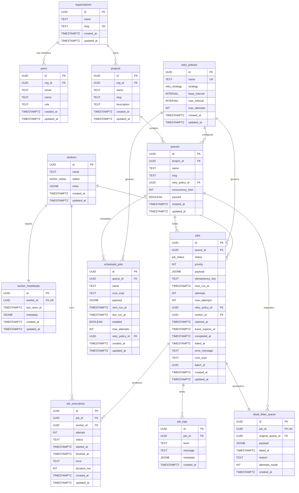

# Entity-Relationship Diagram

## Cascade Behavior

| Parent deleted | Cascades to | ON DELETE |
|---|---|---|
| `organizations` | `users`, `projects` → `queues` → `jobs` → `job_executions`, `job_logs`, `dead_letter_queue` | CASCADE (transitive) |
| `projects` | `queues` → `jobs` → … | CASCADE |
| `queues` | `jobs`, `scheduled_jobs`, `dead_letter_queue` | CASCADE |
| `jobs` | `job_executions`, `job_logs`, `dead_letter_queue` | CASCADE |
| `workers` | `worker_heartbeats` (CASCADE), `jobs.worker_id` (SET NULL), `job_executions.worker_id` (SET NULL) | Mixed |
| `retry_policies` | `queues.retry_policy_id`, `jobs.retry_policy_id`, `scheduled_jobs.retry_policy_id` | SET NULL |

## Key Indexes

| Index | Type | Purpose |
|---|---|---|
| `idx_jobs_claim` | Partial B-tree `(queue_id, priority DESC, next_run_at) WHERE status = 'queued'` | Atomic claim query — index-only scan, no sort |
| `idx_jobs_idempotency` | Unique partial `(queue_id, idempotency_key) WHERE idempotency_key IS NOT NULL` | Deduplicate within a queue |
| `idx_jobs_reaper` | Partial B-tree `(lease_expires_at) WHERE status IN ('claimed','running')` | Reaper stale-lease scan |
| `idx_jobs_worker_id` | Partial B-tree `(worker_id) WHERE worker_id IS NOT NULL` | Lease release on graceful shutdown |
| `idx_worker_heartbeats_last_seen` | B-tree `(last_seen_at)` | Stale worker detection |
| `idx_scheduled_jobs_due` | Partial B-tree `(next_run_at) WHERE enabled` | Cron tick evaluation |
